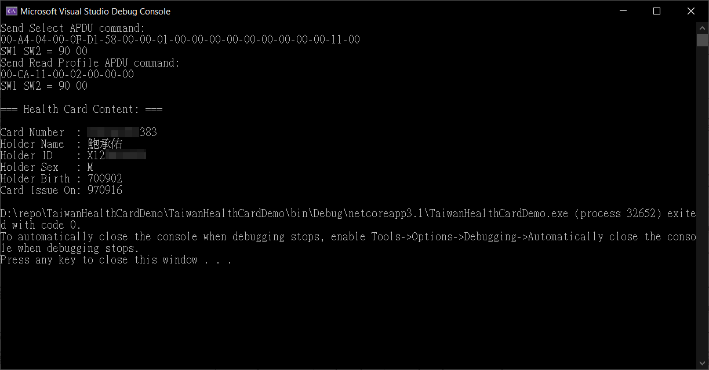

# Taiwan NHI Card Reading Data Demo

This repoistory contains a .NET Core 3.1 demo console app to show how to read the [***Public*** allow access data of Taiwan resident's **NHI**(National Health Insurance) Card](https://www.nhi.gov.tw/Content_List.aspx?n=ABBBF3906BFF712A) via Smart Card Reader:

It use the [PCSC library](https://github.com/danm-de/pcsc-sharp) to access Smart Card reader, so be sure to obey the system requirements of that for this demo project to be functional.

The public field data format reference of NHI Card is [here](http://www.pda.org.tw/nan/1041215/12-2附件/健保卡資料上傳作業說明.pdf).
